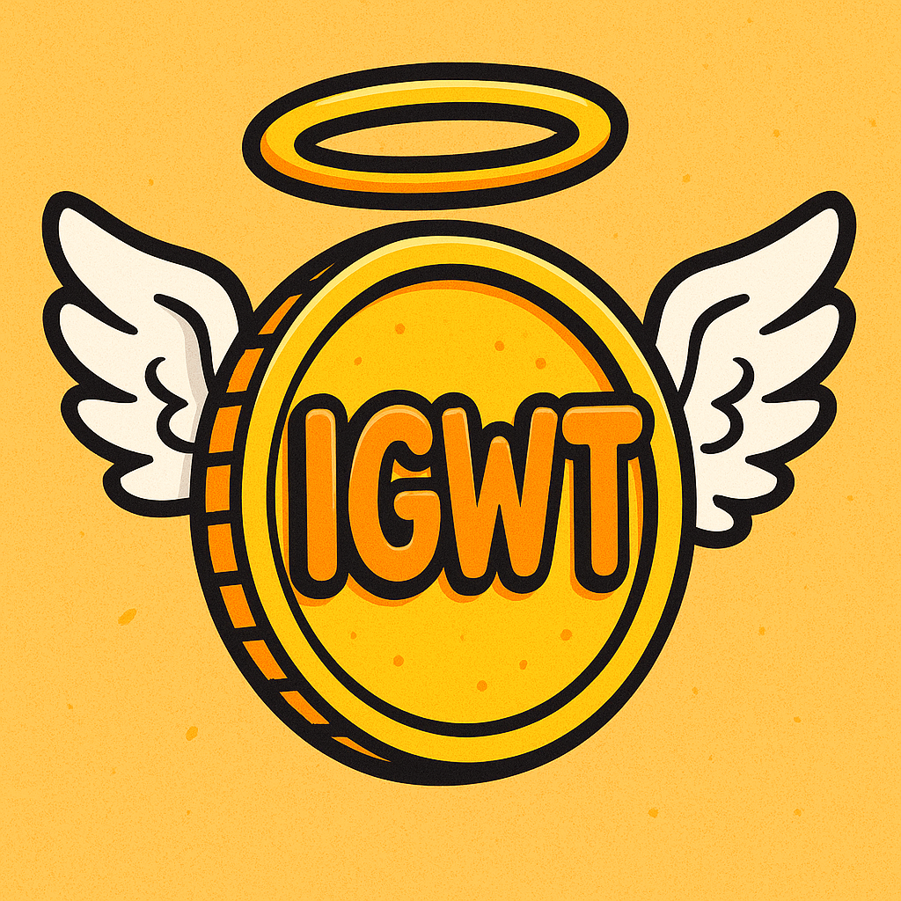

<div align="center">

# 🌟 **IGWT – In God We Trust**

### *A community-driven meme token on Solana*



[](https://solana.com) []() []()

</div>

---

## 🔹 Overview

**IGWT (In God We Trust)** is a decentralized, community-first meme token built on the **Solana blockchain**. Inspired by the success of BONK and other community coins, IGWT blends humor and hope — proving that memes can unite and empower people.

* **Ticker:** IGWT
* **Blockchain:** Solana (SPL Token)
* **Total Supply:** `100,000,000,000,000` IGWT
* **Decimals:** 5
* **Mint Authority:** Revoked after launch
* **Freeze Authority:** Revoked

---

## ✨ Mission

> "In Memes We Trust, In Community We Believe."

IGWT spreads positivity through memes and empowers individuals to build something together — decentralized, transparent, and purely for fun.

* 🌍 **Community first:** No VC, no presale, fair launch
* 🔒 **Trust by design:** Authorities revoked, transparent wallets
* 💬 **Positivity through memes:** Joy, unity, and creative freedom

---

## 💰 Tokenomics (BONK-inspired)

| Category                    | Allocation | Tokens             | Notes                               |
| --------------------------- | ---------- | ------------------ | ----------------------------------- |
| 🪂 Community Airdrop        | 50%        | 50,000,000,000,000 | Distributed within 7 days of launch |
| 👥 Team & Contributors      | 20%        | 20,000,000,000,000 | Vesting over 3 years                |
| 🏦 DAO / Treasury           | 15%        | 15,000,000,000,000 | Gradual unlock, DAO-managed         |
| 📢 Marketing & Partnerships | 5%         | 5,000,000,000,000  | Released over 12 months             |
| 💧 Initial Liquidity        | 5%         | 5,000,000,000,000  | Locked for 12 months                |
| 🛡️ Reserve                 | 5%         | 5,000,000,000,000  | Future DAO-controlled               |

**Deflationary mechanics:**
🔥 Periodic community burns + optional partner route burns (up to 1% per eligible transaction).

---

## 🗺️ Roadmap

**Phase 1 – Preparation**

* Branding, socials, token testing, finalize tokenomics.

**Phase 2 – Launch**

* Deploy on Solana, lock LP, airdrop, meme campaign.

**Phase 3 – Growth**

* Influencer partnerships, weekly challenges, Burn #1, DAO setup.

**Phase 4 – Utility & DAO**

* Governance voting, staking options, NFT integrations.

---

## ⚖️ Legal Disclaimer

This project is for entertainment and community purposes only. Nothing in this repository or its content constitutes financial, legal, or investment advice.
Cryptocurrency investments are volatile and can result in **total loss**. Always DYOR (Do Your Own Research).

---

## 🏗️ Website Structure

```
📂 / (root)
 ┣ index.html            → Main landing page
 ┣ whitepaper.html       → Full IGWT Whitepaper
 ┣ impressum.html        → Legal notice (Germany)
 ┣ datenschutz.html      → GDPR-compliant privacy policy
 ┣ IGWT.png              → Token logo
```

---

## 🚀 Deployment

Hosted via **GitHub Pages**.
Every push to the `main` branch automatically updates the live site.

**Visit:** [https://YOUR-USERNAME.github.io/igwt-website/](#)

---

## 📬 Contact

📧 **Email:** [lo-m@mein.gmx](mailto:lo-m@mein.gmx)
🐦 **Twitter:** [@igwtcoin](https://twitter.com/igwtcoin)
💬 **Discord:** [discord.gg/igwt](https://discord.gg/igwt)

---

<div align="center">

© 2025 **Marco Krämer – IGWT Project**
*Made with 💛 by the community, for the community.*

</div>
